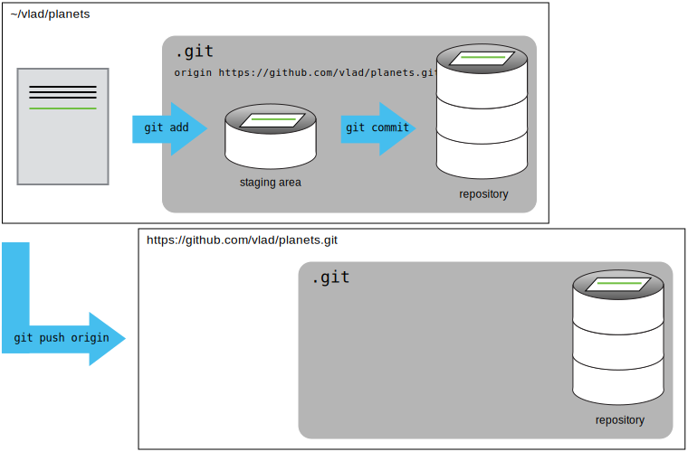

## Other required reporting metrics

In addition to the code provided in the previous lessons, what other metrics are important in your lab?
- For example, many reports will have a specific reporting window. Are there outstanding questions about selecting only relevant data?
- Are there additional metrics needed like the number of active stations or number of stations downloaded?

## Introduction to Git

Git is a common command-line interface used by developers worldwide to share their work with colleagues and keep their code organized. Teams are not the only ones to benefit from version control: lone researchers can benefit immensely. Keeping a record of what was changed, when, and why is extremely useful for all researchers if they ever need to come back to the project later on (e.g., a year later, when memory has faded).

Version control is the lab notebook of the digital world: it’s what professionals use to keep track of what they’ve done and to collaborate with other people. Every large software development project relies on it, and most programmers use it for their small jobs as well. And it isn’t just for software: books, papers, small data sets, and anything that changes over time or needs to be shared can and should be stored in a version control system.

Git is the version control software and the coding language. GitHub is the website where Git folders/code can be shared and edited by collaborators.

### What can Git do for you?

- Archive all your code changes, for safekeeping and posterity
- Share and build code within your group and across the globe

### Why Git is valuable 

Think about Google Docs or similar... but for code and data!
- Version Control 
- Collaboration
- One True Codebase – authoritative copy shared among colleagues
- Documentation of any changes
- Mark and retrieve the exact version you ran from any point in time, even if it's been "overwritten"
- Resolve conflicts when editors change the same piece of content
- Supporting open science, open code, and open data. A requirement for a lot of publications!

### Basic commands

Turn my code folder into a Git Repository
1. `git init`
1. `git add .` adds ALL files to Git's tracking index
1. `git commit -m 'add your initial commit message here, describing what this repo will be for'` saves everything that has been "added" to the tracking index. 

You will always need to ADD then COMMIT each new file.

Link your Git Repository to the GitHub website, for storage and collaboration
1. `git remote add origin [url]` telling git the web-location with which to link
1. `git push -u origin master` pushes your work up to the website, in the "master" master!

To add the latest changes to the web-version while you're working you will always have to ADD, then COMMIT, then PUSH the changes.

Clone a Git Repository to your computer to work on it
1. `git clone [paste the url]` 
1. `git pull` to get the newest changes from the web-version at any time!

In summary, you should PULL any new changes to keep your repository synced with the website where other people are working, then ADD/COMMIT/PUSH your changes back to the website for other people to see!

**As an alternative** - you can use an app like [TortoiseGit (Windows)](https://tortoisegit.org/download/) or [SourceTree (MAC)](https://www.sourcetreeapp.com) to stay away from command line. GitHub also has an app! The commands will be the same (ADD, PUSH, etc.) but you will be able to do them by pushing buttons instead of writing them into a command line terminal.

### Resources

- An excellent introductory lesson is available from [the Carpentries](https://swcarpentry.github.io/git-novice/)
- [Oh shit, git](https://ohshitgit.com/) is a website that helps you troubleshoot Git with plain-language search terms
- NYU has a curriculum for sharing within labs - available [here](https://nyu-cdsc.github.io/learningr/)
- [This article](https://towardsdatascience.com/why-git-and-how-to-use-git-as-a-data-scientist-4fa2d3bdc197) explains why data scientists (us!) should be using Git